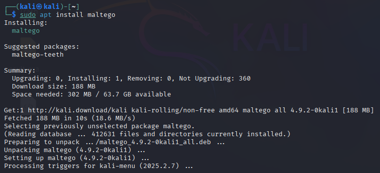

# maltego - OSINT Tool تطبيقاتي العملية لأداة

This section provides a complete walkthrough on how to use theHarvester — a powerful OSINT (Open Source Intelligence) tool used for gathering publicly available information about a target.

---

## 🔍 What is maltego?

Maltego is a powerful OSINT and link analysis tool used for gathering and visualizing data about people, companies, domains, and networks. It helps security professionals, penetration testers, and digital investigators to map relationships using publicly available information.

---

### 1. Install via terminal:
```
sudo apt update
sudo apt install maltego
```



---

### 2. Launch Maltego
Open the terminal and run:
```
maltego
```


Alternatively, you can find it in the Applications > reconnaissance menu in Kali's GUI.


---

### 3. Create a Free Account
   
When you first launch Maltego, you’ll be asked to create a Paterva account.

This is required to access the Community Edition (CE).

After registration, log in inside the Maltego application.


---

### 4. Create a New Graph

After login:

Click "New Graph".

You’ll be presented with a blank workspace.

Choose an entity to start with (like a domain name, email address, person, etc.).


---
### 5. Add an Entity
   
Example: Investigating a Domain

From the left sidebar, drag the "Domain" entity into the graph.

Double-click it to edit the domain name (e.g., example.com).

Right-click on the domain entity.

Select "Run All Transforms" or individual transforms like:

To DNS name

To MX records

To IP addresses

To WHOIS information


---

### 6. What Are Transforms?

Transforms are built-in scripts that gather information from various sources and visualize relationships (like email addresses, DNS data, subdomains, etc.).

There are both free and commercial transforms.

---

### 7. Visualize Relationships
As you run transforms, Maltego will:

Populate the graph with new entities (emails, hosts, IPs, etc.).

Automatically draw links showing how entities are related.

Allow you to zoom in, label, and color-code nodes for clarity.

---

### 8. Save and Export
You can save your investigation as:

.mtgl – Maltego project file.

Export reports or screenshots of your graph for documentation.


---


### Example Use Cases of Maltego

Mapping subdomains of a target domain.

Finding email addresses linked to a website.

Discovering relationships between social media accounts.

Investigating breach data and leaked credentials (with plugins).

Tracking infrastructure relationships (IPs, ASNs, DNS records).

---

### Bonus Tips

Use Maltego Community Edition (CE) for free.

You can install extra transforms (e.g., Shodan, HaveIBeenPwned, VirusTotal) via Transform Hub.

For deeper analysis, use with other OSINT tools like theHarvester, SpiderFoot, etc.
